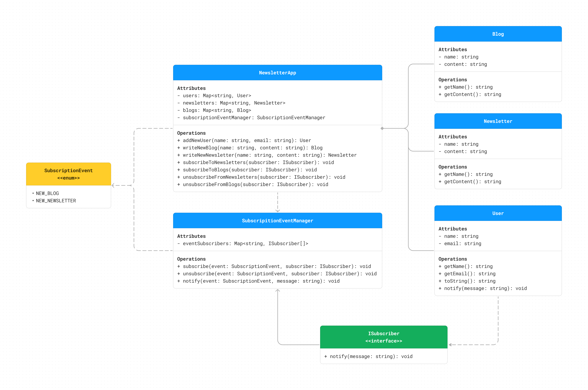
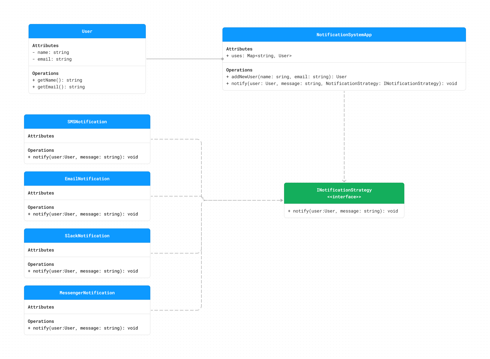

# Design Patterns

## Table of Contents

<!-- TOC -->

- [Design Patterns](#design-patterns)
  - [Table of Contents](#table-of-contents)
  - [Behavioral Patterns](#behavioral-patterns)
    - [Observer Pattern](#observer-pattern)
      - [Observer Pattern Example](#observer-pattern-example)
      - [Observer Pattern Exercise](#observer-pattern-exercise)
    - [Strategy Pattern](#strategy-pattern)
      - [Strategy Pattern Example](#strategy-pattern-example)
      - [Strategy Pattern Exercise 1](#strategy-pattern-exercise-1)

<!-- /TOC -->

## Behavioral Patterns

### Observer Pattern

#### Observer Pattern Example

**Use Case:**

- We want to create a marketplace notification system where users can subscribe to notifications for new product arrivals or new offers in an online marketplace. Whenever a new product or new offer is added to the marketplace, subscribed users should receive notifications.
- We should allow both adding new subscribers and cancelling subscription as well.

**Design:**

**Implementation:**

- Look at the [Marketplace Notification System](./observer) for the implementation.
- Run command `yarn install`
- Run command `yarn run start:marketplace`

#### Observer Pattern Exercise

**Use Case:**

- Develop a newsletter for an author who wants to notify his subscribers about each new blog post or newsletter weekly.
- Considering that subscribers might want to get notifications for each blog post, newsletter, or both of them,.
- Subscribers can also unsubscribe, and then they should not get any notifications.

**Design:**

**Implementation:**

- Look at the [Newsletter System](./observer) for the implementation.
- Run command `yarn install`
- Run command `yarn run start:newsletter`

_**[TOP ↑](#design-patterns)**_

### Strategy Pattern

#### Strategy Pattern Example

**Use Case:**

- Develop an e-commerce platform where different products may have varying pricing logic based on factors such as customer segment. We have regular, gold and premium membership.
- Once product price is calculated, then at the checkout the customer could pay with different methods like PayPal, VisaCard and BankTransfer. Each payment method vary in it’s logic of processing the payment and conducting required fees.

**Design:**

**Implementation:**

- Look at the [Ecommerce System](./strategy/) for the implementation.
- Run command `yarn install`
- Run command `yarn run start:ecommerce`

_**[TOP ↑](#design-patterns)**_

#### Strategy Pattern Exercise 1

**Use Case:**

- We want to create a marketplace notification system where users can subscribe to notifications for new product arrivals or new offers in an online marketplace. Whenever a new product or new offer is added to the marketplace, subscribed users should receive notifications.
- We should allow both adding new subscribers and cancelling subscription as well.

**Design:**

**Implementation:**

- It's easy to implement this example by following the UML Diagram Above.

_**[TOP ↑](#design-patterns)**_
