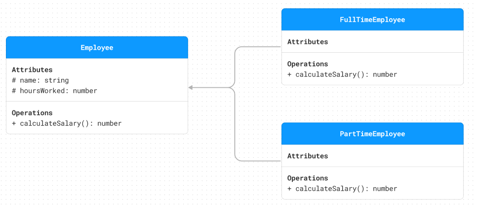

# SOLID Principles

SOLID is an acronym for the first five object-oriented design (OOD) principles by Robert C. Martin (also known as Uncle Bob).

## Table of Contents

<!-- TOC -->

- [SOLID Principles](#solid-principles)
  - [Table of Contents](#table-of-contents)
  - [Single Responsibility Principle SRP](#single-responsibility-principle-srp)
    - [SRP Examples](#srp-examples)
      - [Email Service Example](#email-service-example)
      - [OrderManagement Service Example](#ordermanagement-service-example)
  - [Open/Closed Principle OCP](#openclosed-principle-ocp)
    - [OCP Examples](#ocp-examples)
      - [DiscountCalculator Example](#discountcalculator-example)
      - [PaymentProcessing Service Example](#paymentprocessing-service-example)
  - [Liskov Substitution Principle LSP](#liskov-substitution-principle-lsp)
    - [LSP Examples](#lsp-examples)
      - [Employee Example](#employee-example)
    - [Order Example](#order-example)
  - [Interface Segregation Principle ISP](#interface-segregation-principle-isp)
    - [ISP Examples](#isp-examples)
      - [Task Management Example](#task-management-example)
  - [Dependency Inversion Principle DIP](#dependency-inversion-principle-dip)
    - [DIP Example](#dip-example)

<!-- /TOC -->

## Single Responsibility Principle (SRP)

A class should have only one reason to change, meaning that a class should have only one job.

### SRP Examples

#### Email Service Example

**Before:**


**After:**


#### OrderManagement Service Example

**Before:**


**After:**


_**[TOP ↑](#solid-principles)**_

## Open/Closed Principle (OCP)

- Software entities (classes, modules, functions, etc.) should be open for extension, but closed for modification.

### OCP Examples

#### DiscountCalculator Example

**Before:**


```typescript
class DiscountCalculator {
  calculateDiscount(product: Product): number {
    switch (product.getType()) {
      case "electronic":
        return product.getPrice() * 0.1;
      case "furniture":
        return product.getPrice() * 0.2;
      case "clothing":
        return product.getPrice() * 0.3;
      default:
        return 0;
    }
  }
}
```

**After:**


```typescript
interface IDiscountStrategy {
  calculateDiscount(product: Product): number;
}

class ElectronicDiscountStrategy implements IDiscountStrategy {
  calculateDiscount(product: Product): number {
    return product.getPrice() * 0.1;
  }
}

class FurnitureDiscountStrategy implements IDiscountStrategy {
  calculateDiscount(product: Product): number {
    return product.getPrice() * 0.2;
  }
}

class ClothingDiscountStrategy implements IDiscountStrategy {
  calculateDiscount(product: Product): number {
    return product.getPrice() * 0.3;
  }
}

class DiscountCalculator {
  private readonly discountStrategy: IDiscountStrategy;

  constructor(discountStrategy: IDiscountStrategy) {
    this.discountStrategy = discountStrategy;
  }

  calculateDiscount(product: Product): number {
    return this.discountStrategy.calculateDiscount(product);
  }
}
```

#### PaymentProcessing Service Example

**Before:**


```typescript
class PaymentProcessingService {
  processPayment(payment: Payment): void {
    switch (payment.getType()) {
      case "visa":
        // Process credit card payment
        break;
      case "mastercard":
        // Process debit card payment
        break;
      case "american express":
        // Process PayPal payment
        break;
      default:
        throw new Error("Invalid payment type");
    }
  }
}
```

**After:**


```typescript
interface IPaymentStrategy {
  processPayment(amount: number): void;
}

class Visa implements IPaymentStrategy {
  processPayment(amount: number): void {
    // Process credit card payment
  }
}

class MasterCard implements IPaymentStrategy {
  processPayment(amount: number): void {
    // Process debit card payment
  }
}

class AmericanExpress implements IPaymentStrategy {
  processPayment(amount: number): void {
    // Process PayPal payment
  }
}

class PaymentProcessingService {
  private readonly paymentStrategy: IPaymentStrategy;

  constructor(paymentStrategy: IPaymentStrategy) {
    this.paymentStrategy = paymentStrategy;
  }

  processPayment(order: Order): void {
    this.paymentStrategy.processPayment(order.getPrice());
  }
}
```

_**[TOP ↑](#solid-principles)**_

## Liskov Substitution Principle (LSP)

- If S is a subtype of T then objects of type T in a program may be replaced with objects of type S without altering any of the desirable properties of that program

### LSP Examples

#### Employee Example

**Before:**



```typescript
class Employee {
  protected name: string;
  protected hoursWorked: number;

  constructor(name: string, hoursWorked: number) {
    this.name = name;
    this.hoursWorked = hoursWorked;
  }

  public calculateSalary(): number {
    return this.hoursWorked * 10;
  }
}

class FullTimeEmployee extends Employee {
  public override calculateSalary(): number {
    return super.calculateSalary() + 100;
  }
}

class PartTimeEmployee extends Employee {
  public override calculateSalary(): number {
    return super.calculateSalary() + 50;
  }
}
```

**After:**


```typescript
class Employee {
  protected name: string;
  protected hoursWorked: number;

  constructor(name: string, hoursWorked: number) {
    this.name = name;
    this.hoursWorked = hoursWorked;
  }
}

interface IEmployeeSalaryCalculator {
  calculateSalary(employee: Employee): number;
}

class FullTimeEmployeeSalaryCalculator
  extends Employee
  implements IEmployeeSalaryCalculator
{
  calculateSalary(employee: Employee): number {
    return employee.hoursWorked * 100;
  }
}

class PartTimeEmployeeSalaryCalculator
  extends Employee
  implements IEmployeeSalaryCalculator
{
  calculateSalary(employee: Employee): number {
    return employee.hoursWorked * 50;
  }
}
```

### Order Example

**Before:**


```typescript
class Order {
  protected id: string;
  protected price: number;

  constructor(id: string, price: number) {
    this.id = id;
    this.price = price;
  }

  public getId():string() {
    return this.id;
  }

  public getPrice():number {
    return this.price;
  }

  public calculateTotalPrice(): number {
    return this.price;
  }
}

class DeliveryOrder extends Order {
  private static readonly SHIPPING_COST: number = 10;

  public override calculateTotalPrice() {
    return super.calculateTotalPrice() + DeliveryOrder.SHIPPING_COST;
  }
}

class PickUpOrder extends Order {}
```

**After:**


```typescript
class Order {
  protected id: string;
  protected price: number;

  constructor(id: string, price: number) {
    this.id = id;
    this.price = price;
  }

  public getId():string() {
    return this.id;
  }

  public getPrice():number {
    return this.price;
  }
}

interface IDeliveryOrderPriceCalculator {
  calculateTotalPrice(order: Order): number;
}

class DeliveryOrder extends Order  implements IDeliveryOrderPriceCalculator{
  private static readonly SHIPPING_COST: number = 10;

  public calculateTotalPrice() {
    return this.price + DeliveryOrder.SHIPPING_COST;
  }
}

class PickUpOrder extends Order {}
```

_**[TOP ↑](#solid-principles)**_

## Interface Segregation Principle (ISP)

- No code should be forced to depend on methods it does not use. ISP splits interfaces that are very large into smaller and more specific ones.

### ISP Examples

#### Task Management Example

**Before:**


```typescript
interface ITaskManager {
  createTask(taskName: string): void;
  assignTask(taskName: string, assign: string): void;
  sendNotification(message: string, recipient: string): void;
}

class TaskService implements TaskManager {
  public override createTask(taskName: string): void {
    // Create task logic
  }

  public override assignTask(taskName: string, assign: string): void {
    // Assign task logic
  }

  public override sendNotification(message: string, recipient: string): void {
    // Hey i didn't need this method, so i will throw an error that i didn't support this method
  }
}
```

> This design violates the SRP principle because the `TaskService` class has many responsibilities, and also violates the ISP principle because the `TaskService` class is forced to implement methods that it does not use.

**After:**


```typescript
interface ITaskCreator {
  createTask(taskName: string): void;
}

interface ITaskAssigner {
  assignTask(taskName: string, assign: string): void;
}

interface INotificationSender {
  sendNotification(message: string, recipient: string): void;
}

class TaskService implements ITaskCreator, ITaskAssigner {
  public override createTask(taskName: string): void {
    // Create task logic
  }

  public override assignTask(taskName: string, assign: string): void {
    // Assign task logic
  }
}
```

_**[TOP ↑](#solid-principles)**_

## Dependency Inversion Principle (DIP)

- High-Level modules should not depend on Low-Level modules, Both should depend on abstractions.
- Abstractions should not depend on details, Details should depend on abstractions

### DIP Example

**Before:**


**After:**


_**[TOP ↑](#solid-principles)**_
